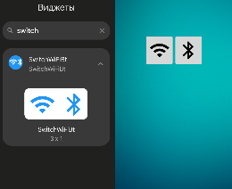

# SwitchWiFiBt

Android-виджет для быстрого управления Wi-Fi и Bluetooth прямо с домашнего экрана.



## Возможности

- **Кнопка Wi-Fi** — открывает системную панель управления интернет-подключением (`ACTION_INTERNET_CONNECTIVITY`)
- **Кнопка Bluetooth** — включает Bluetooth и открывает панель сопряжённых устройств:
  - Переключатель вкл/выкл Bluetooth (через root)
  - Список сопряжённых устройств с возможностью подключения/отключения
  - Индикация текущего активного устройства
  - Кнопка перехода в системные настройки Bluetooth
  - Кнопка "Готово" для закрытия панели
  - Дизайн в стиле системной панели `ACTION_INTERNET_CONNECTIVITY` (bottom sheet)

## Системные требования

- Android 12+ (API 31)
- Root-доступ (для тихого включения/выключения Bluetooth без системных диалогов)
- Без root: используется стандартный системный запрос на включение Bluetooth

## Технические характеристики

- Язык программирования: Java
- Минимальная версия SDK: 31
- Целевая версия SDK: 34
- Версия для сборки (Compile SDK): 35

## Используемые библиотеки

- AndroidX AppCompat
- Material Design Components

## Разрешения

- `BLUETOOTH_CONNECT` — подключение к сопряжённым Bluetooth-устройствам

## Структура проекта

| Файл | Описание |
|------|----------|
| `NetworkWidgetProvider` | Виджет с кнопками Wi-Fi и Bluetooth |
| `PermissionActivity` | Прозрачная активность: запрос разрешений, включение BT через root |
| `DeviceListActivity` | Bottom-sheet панель со списком сопряжённых устройств |
| `DeviceListAdapter` | Адаптер списка устройств с индикацией подключения |

## Сборка проекта

1. Клонируйте репозиторий:
```bash
git clone https://github.com/sanchousmutant/SwitchWiFiBt.git
```

2. Откройте проект в Android Studio

3. Синхронизируйте проект с Gradle файлами

4. Запустите сборку:
```bash
./gradlew assembleDebug
```

APK будет в `app/build/outputs/apk/debug/app-debug.apk`.

## Как работает

1. Пользователь добавляет виджет на домашний экран
2. **Wi-Fi**: нажатие открывает системную панель интернет-подключения
3. **Bluetooth**: нажатие запускает цепочку:
   - Проверка/запрос разрешения `BLUETOOTH_CONNECT`
   - Включение Bluetooth через `svc bluetooth enable` (root) или системный диалог (fallback)
   - Открытие bottom-sheet панели с переключателем BT и списком сопряжённых устройств
